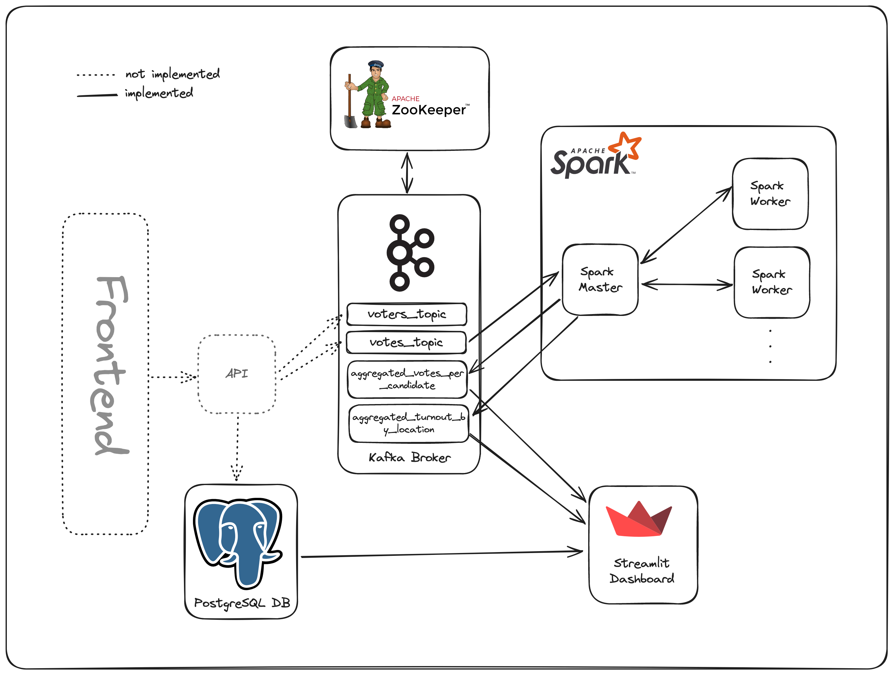

# Real-Time Voting Data Pipeline

A real-time voting system that uses Apache Kafka, PostgreSQL, Apache Spark, Apache Zookeeper and Streamlit.

## Architecture



## Instructions

### Prerequisites:

- Docker and Docker Compose installed on your machine (Preferably through Docker Desktop).
- Make sure that the following ports are free:
  - 8501
  - 2181
  - 9092
  - 9101
  - 5432
  - 8080
  - 7077

### Steps to Run:

1. Clone the Github repo on your machine:

```
git clone https://github.com/ilyasben26/Realtime-Voting-Pipeline
```

2. Run docker compose

```
docker-compose -up -d
```

3. Wait for for docker to pull the images and run the containers.
4. Generate voters and candidates data:

```
 docker exec -d pyspark python generate_data.py
```

5. Inititate the voting procedure:

```
 docker exec -d pyspark python simulate_voting.py
```

6. Run Spark to aggregrate the voting data in real-time:

```
 docker exec -d pyspark python spark_streaming.py
```

7. Visit `http://localhost:8501` to see the Streamlit dashboard get updated in real-time with the results of the election.

# What I learned from this project:

- Using Docker and Docker Compose to containerize data pipelines.
- Basics of Apache Spark.
- Working with Kafka topics, consumers and producers.
- Using Streamlit to create interactive data dashboards.

# Screenshot of the Dashboard


